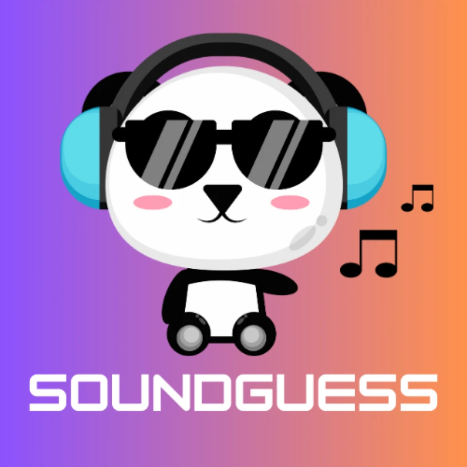
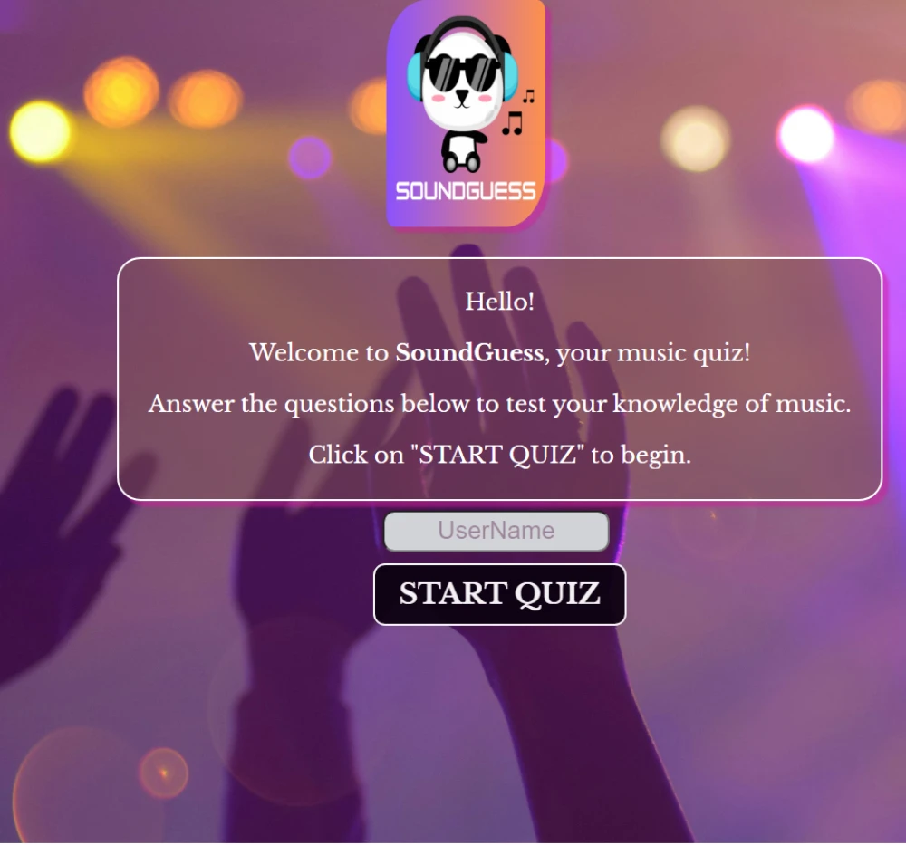

# SoundGuess

---------
[View the Live Webiste Here](https://miriamdosantos.github.io/Sound-Guess/)  
# Table of Contents

- [SoundGuess](#soundguess)
  - [Project Goals](#project-goals)
  - [User Experience](#user-experience)
  - [Design](#design)
  - [Technologies Used](#technologies-used)
  - [Features](#features)
  - [Testing](#testing)
  - [Bug Report](#bug-report)
    - [Description](#description)
    - [Steps to Reproduce](#steps-to-reproduce)
    - [Expected Result](#expected-result)
    - [Actual Result](#actual-result)
    - [Fix](#fix)
    - [Incorrect Timer Functionality](#incorrect-timer-functionality)
    - [Description](#description-1)
    - [Steps to Reproduce](#steps-to-reproduce-1)
    - [Expected Result](#expected-result-1)
    - [Actual Result](#actual-result-1)
    - [Fix](#fix-1)
    - [Description](#description-2)
    - [Steps to Reproduce](#steps-to-reproduce-2)
    - [Expected Result](#expected-result-2)
    - [Actual Result](#actual-result-2)
    - [Fix](#fix-2)
  - [Deployment](#deployment)
    - [Version Control](#version-control)
    - [Deployment to Github pages](#deployment-to-github-pages)
    - [Cloning Repository Code locally](#cloning-repository-code-locally)
  - [Credits](#credits)
    - [Content](#content)
    - [Media](#media)

## Project Goals
---------
The project aims to develop a music quiz game called "SoundGuess." Players answer music-related questions within a time limit, receiving feedback on their answers and accumulating points as they progress. The game ends with a final score and feedback based on the player's performance.
* User Goals:
  1. __Engagement__: Users seek an interactive and enjoyable experience while participating in the music quiz.
  2. __Challenge__: Users want to be challenged with music-related questions to test their knowledge and skills.
  3. __Feedback__: Users expect immediate feedback on their answers to understand whether they are correct or incorrect.
  4. __Scoring__: Users aim to achieve a high score by answering questions correctly within the given time limit.
  5. __Learning__: Users may want to enhance their knowledge of music by learning from the questions and feedback provided during the quiz.  
* Site Owner Goals
  * __User Engagement__: Encouraging visitors to spend time on the website by providing an entertaining and interactive music quiz experience.
  * Creating user friendly game
  * The game should be fully responsive to be able to be played on different screen sizes.
  ## User Experience
* Target Audience
  * __Music enthusiasts:__ People who have a passion for music and enjoy exploring different genres, artists, and trivia related to music.
  * __Casual gamers__: Individuals looking for a fun and entertaining way to spend their leisure time while also challenging themselves with quiz questions.
  * __Students:__ Those studying music or related fields who want to test their knowledge and reinforce their learning in a interactive way.  
  Overall, the target audience comprises a broad spectrum of individuals united by their love for music and their desire for an enjoyable and interactive online experience.
* User Requirements and Expectations
  * __Engaging Content:__ Varied and challenging quiz questions covering music genres, artists, and history.
  * __Intuitive Interface:__ Easy navigation for starting, answering, and progressing through questions.
  * __Responsive Design:__ Compatibility across devices with seamless viewing and interaction and Accesabillity
  * Accesabillity and good design on all screen devices
* User Stories
  1. As a music enthusiast, I want to test my knowledge across different genres and eras.
  2. As a casual user, I want a user-friendly interface to easily navigate through the quiz.
  3. As a mobile user, I want the website to be responsive and optimized for my device.
  4. As a new user, I want clear instructions on how to start the quiz and answer questions.
  5. As a competitive user, I want immediate feedback on whether my answers are correct.
  6. As a visual learner, I want engaging images and graphics to enhance my quiz experience.
  7. As a user with limited time, I want a countdown timer to manage my quiz completion.
  8. As a returning user, I want the option to personalize my experience with a username.
  9. As a music trivia enthusiast, I want challenging questions that push my knowledge limits.  
## Desing
* Design Choices
  * The quiz was designed as a 3 page, where first pages gives user quick glance on what this quiz is about, within the username area and button to start, while second page is displayed the quiz, with the question, and options to select. And where de user can see the immediate feedback (dicating whether answers are correct or incorrect); Integrating a countdown timer to create a sense of urgency and challenge, motivating users to complete the quiz within the given time frame. For the last page its display the a motivition message based on the score. 
* Color
  * Main colours that I picked for this project were : #fff, rgba(210, 29, 158, 0.5),
* Fonts
   For the fonts, I've used "Libre Baskerville", serif; font which gives whole page a nice and clean atmohosfere
* Wiframes
  * The site was developed with the Mobile layout  method first. The wireframes were therefore drawn with that thought in mind and adapted along of the project, and created with [Balsamiq](https://balsamiq.cloud/), on the sequence of the Welcome Page, Quiz Game and Final Quiz.
  

## Technologies Used
* Languages
  * HTML
  * CSS
  * avaScript
* Frameworks & Tools
  * Git
  * GitHub
  * Visual Studio
  * Font Awesome
  * Canva
  * Balsamiq
  * JSHint
  * W3C Markup validation service
  * W3C Jigsaw CSS validation service
## Features 
The site consists of tree pages
* __Welcome page__
  * In the header section: positioned at the top left, the website logo, custom-designed to complement the overall style of the page, proudly showcases the name of the quiz: SoundGuess. Clicking on the logo navigates the user back to the home page, providing seamless access to the main content."
  
  * Provides user to type his name which will be displayed on the gaming page next to the logo, and on the top of the questions container with button for user to start to play the game.
  * 
  * 
  
* __Game page__
  * 
  * Container that display quiz questions and options to select
  * 
  * Countdown bar that's let the user known that there is a time for answer the questions, as well  to create a sense of urgency and challenge.
  
  * Including a user label feature to prominently display the user's name enhances personalization and engagement
  * Times Up Image: When the countdown timer reaches zero, the 'times up' message is displayed along with a shaking animation. After a brief delay, both the message and any associated audio are hidden."
  
  
  * Displaying the score prominently throughout the quiz provides users with instant feedback on their performance
  
  * The 'Next' button is toggled between enabled and disabled states, ensuring users can only proceed to the next question after making a selection
  
  * Feedback: When the user selects an option, the feedback mechanism provides a comprehensive response. If the answer is correct, it displays an image associated with the correct answer along with a success audio cue. However, if the answer is incorrect, only the fail audio cue is played.
  
* __Final Result__
  * A congratulatory message is shown along with the user's score. 
   
   * Additionally, feedback corresponding to the user's performance is provided, with messages ranging from encouragement to reflect their score. Messages such as 'Well done! You're on the right track,' or 'Keep practicing to reach even higher!' are included to motivate users based on their quiz performance
   
   * A button to play the quiz again in the case the users wants to, that's brings the user to Welcome Page
   
## Testing

* HTML Validation
  *  [HTML Validator](https://validator.w3.org/#validate_by_upload) was run on the index.html page of the project, and small syntax errors identified were fixed. At the final stage no errors or warnings were found.
  
* CSS Validation
  * [CSS Validator](https://jigsaw.w3.org/css-validator/validator) was run on the style.css page of the project, and straight way no error or warnings were found.
  
* JavaScript Validation
 * [JSHint Static Code Analysis Tool] (https://jshint.com/) for JavaScript was used to validate the Javascript file. There were 5 no use variable that I declared in the beging, but after in the function as well, so I deleted that and I receveid some warmings related to what extensions is not available at some browers.
 
* Performance & Accessibility
  * I used Lighthouse within the Chrome Developer Tools to allow me to test the performance, accessibility, best practices and SEO of the website, in a mobile as well.And confirmed that the colors and fonts are easy to read and that the site is accessible.
  
* Browser Compatability
  The website was tested succesfully on the following browsers:
  * Google Chrome
  * Mozilla Firefox
  * Microsoft Edge
## Testing User Stories for SoundGuess
* 1. User Registration Testing Story:
  * As a new user, I want to register my name to participate in the quiz.
  * Acceptance Criteria:
    * The registration form should prompt the user to enter their name.
    * The form should only accept alphabetic characters for the name field.
    * Upon submitting the form, the user's name should be displayed prominently throughout the quiz.
  * Expected Result:
    * After submitting the registration form with a valid name, the user's name should be prominently displayed on the quiz interface throughout the game.
  * Actual Result:
    *  The user's name was successfully displayed on the quiz interface after submitting the registration form with a valid name.
* 2. Quiz Functionality Testing Story:
  * As a player, I want to listen to audio clips and guess the corresponding artist or song title.
  * Acceptance Criteria:
    * Each question should present an audio clip related to a specific artist or song.
    * The quiz should provide multiple-choice options for each question.
    * Feedback should be provided immediately after each answer submission, indicating whether the answer was correct or incorrect.
  * Expected Result:
    * After selecting an answer for each question, the quiz should display immediate feedback indicating whether the answer was correct or incorrect.
  * Actual Result:
    * Immediate feedback was provided after each answer submission, accurately indicating whether the answer was correct or incorrect.
* 3. Score Calculation Testing Story:
  * As a player, I want my score to be calculated accurately based on the number of correct answers.
  * Acceptance Criteria:
    * The score should increment by one for each correct answer.
    * The final score displayed at the end of the quiz should reflect the total number of correct answers out of the total questions.
  * Expected Result:
    * At the end of the quiz, the displayed score should accurately reflect the total number of correct answers out of the total questions.
  * Actual Result:
    * The final score displayed at the end of the quiz accurately reflected the total number of correct answers out of the total questions.
* 4. Timer Functionality Testing Story:
  * As a player, I want the quiz to include a countdown timer for each question.
  * Acceptance Criteria:
    * The countdown timer should start when a question is displayed.
    * The timer should visually indicate the remaining time for each question.
    * If the timer reaches zero before the player submits an answer, the quiz should move to the next question automatically.
  * Expected Result:
    * The countdown timer should start when a question is displayed and visually indicate the remaining time.
    * If the timer reaches zero before the player submits an answer, the quiz should move to the next question as the next button is able again, while the options displayed is not available anymore.
  * Actual Result:
    * The countdown timer functioned as expected, starting when questions were displayed and be able moving to the next question if the timer reached zero before the player submitted an answer.
* 5. Restart Quiz Functionality Testing Story:
  * As a player, I want the option to restart the quiz after completing it.
  * Acceptance Criteria:
    * The quiz should provide a "Play Again" button at the end of the quiz.
    * Clicking the "Play Again" button should reset the quiz to its initial state.
  * Expected Result:
    * Clicking the "Play Again" button at the end of the quiz should reset the quiz to its initial state, allowing the player to start a new game.
  * Actual Result:
    * Clicking the "Play Again" button successfully reset the quiz to its initial state, allowing the player to start a new game.
* Other testing
  I've tested all the buttons to work properly and to lead user where they supposed to and to perform actions that they were meant to, and as well the requeriment for the inputs, and final message displayed thats depends on the score accurated. 
## Bug Report

### Description
During the development of the SoundGuess project, I encountered a bug where the score container (`scoreContainer`) was not being defined before being used in the `showQuestion()` function. This resulted in a reference error when the function was called.

### Steps to Reproduce
1. Start the quiz.
2. Advance to the next question.
3. Notice that the console displays an error indicating that `scoreContainer` is not defined.

### Expected Result
The application should advance to the next question without errors.

### Actual Result
The application throws a reference error for `scoreContainer`.

### Fix
The issue was fixed by defining `scoreContainer` as a parameter in the `showQuestion()` function. Now, the score container is correctly passed to the function, eliminating the reference error.

## Incorrect Timer Functionality:

### Description
During testing of the SoundGuess project, I identified an issue with the timer functionality. The timer was not functioning correctly, leading to inaccurate countdowns and inconsistencies in timing.

### Steps to Reproduce
1. Start the quiz.
2. Observe the countdown timer.
3. Note inaccuracies or inconsistencies in the timing.

### Expected Result
The countdown timer should accurately reflect the specified duration for each question, consistently counting down from the starting value to zero.

### Actual Result
The countdown timer exhibits inaccuracies and inconsistencies, sometimes counting down too quickly or too slowly, or failing to reset properly between questions.

### Fix
The issue with the timer functionality was addressed by revising the `startCountdown()` function. Changes were made to ensure accurate timing and proper reset between questions. Additionally, thorough testing was conducted to validate the effectiveness of the fix.

### Description
While implementing the audio playback functionality in the Music Quiz project, I encountered a bug where a DOMException with the message "The play() request was interrupted" was intermittently thrown in the console. This occurred when attempting to play audio, particularly when there were multiple audio elements in the queue or when trying to play audio rapidly.

### Steps to Reproduce
1. Start the quiz.
2. Interact with the quiz, rapidly clicking on option buttons or advancing to the next question.
3. Observe the console for any DOMException errors related to the "play() request was interrupted."

### Expected Result
Audio should play smoothly without encountering any DOMException errors.

### Actual Result
Intermittently, when attempting to play audio, a DOMException with the message "The play() request was interrupted" occurs in the console.

### Fix
To address this issue, I made the following changes to ensure smooth audio playback:
  * Implemented a queue-based audio playback system to manage multiple audio elements.
  * Added event listeners to the audio elements to handle playback interruptions and ensure proper queue management.
  * Adjusted the code to pause and reset any audio elements currently playing before starting a new audio playback.
  * Utilized try-catch blocks to handle any potential errors during audio playback and provide appropriate error logging.
  With these changes, the issue of interrupted audio playback has been mitigated, and the application now plays audio smoothly without encountering DOMException errors.

## 
## Deployment    
### Versin Control

 * The site was created using VS Code as IDE and pushed to Github to the remote repository 'CelesTial'.
 * Git commands were employed extensively during development to push the code to the remote repository. The sequence of Git commands utilized includes:
    * **git add .**: This command adds the files to the staging area, preparing them for commitment.
    * **git commit -m "commit message"**: It commits the changes to the local repository queue, marking them as ready for the final step.
    * **git push**: This command is executed to push all committed code to the remote repository on Github.  
    ### Deployment to Github pages
    The site was deployed to GitHub pages. The steps taken to deploy are as follows:
    1. Log in to [Github](https://github.com/);
    2. Navigate to [miriamdosantos/SoundGuess](https://github.com/miriamdosantos/CelesTial) in the list of repositories;
    3. In the GitHub repository, navigate to the Settings tab;
    4. In Settings scroll down to GitHub pages which opens in a new page;
    5. From the source section drop-down menu, select the Master Branch;
    6. Once the master branch has been selected, the page is automatically refreshed and a display indicates the successful deployment and the link to the address. 
    The live live link can be acess here: [SoundGuess](https://miriamdosantos.github.io/Sound-Guess/) 
    ### Cloning Repository Code locally
    * To clone the repository code locally, follow these steps:
    1. Navigate to the Github repository you wish to clone;
    2. Click on the "Code" button located above all the project files;
    3. Select "HTTPS" and copy the repository link;
    4. Open the IDE of your choice and paste the copied git URL into the IDE terminal;
    5. Press Enter to execute the command;
    6. The project will now be created as a local clone in your IDE.
    --------- 
    ## Credits
    * I would like to extend a special thanks to my tutor [Spencer Barriball](https://www.linkedin.com/in/spencerbarriball/), whose guidance and support have been invaluable throughout this journey on more time in this second project, always a really good support.
    * I would like to extend my heartfelt thanks to my dear my Husband and StepFather for all the patience, and support, to help me with ideas, and being my tester to this project be possible to be conclude.
    ### Content
    * The Logo and Favicon was created at:[Canva](https://www.canva.com/).
    * I took inspiration from the [Get-it-right](https://github.com/tmarkec/Get-it-right) project for the implementation of the input functionalitty works properly , and for the idea too: [Quiz-Factor] (https://paulasdev.github.io/quiz-factor/#)
    * [Google fonts](https://fonts.google.com/) were used to import the fonts into the style.css file which is used on all pages throughout the project.
    * Part of the English content and to verification of  this website was generated with the assistance of [AI-ChatGPT](https://chat.openai.com/), an AI language model developed by OpenAI.

    ### Media
    * All the images in this website - to display images for the correct  answers the are from : [Microsoft Bing - Images](https://www.bing.com/?FORM=Z9FD1).
    * All the audios use in this project(for the correct and incorrect answers, and times up sounds) free and no copyright issues, are from: [Uppbeat](https://uppbeat.io/sfx/tag/alarm-clock)
    * For a better performance of the website, the images was resizes and changed the format to WEBP using the [Birme](https://www.birme.net/) webiste.

      

  

   

 

